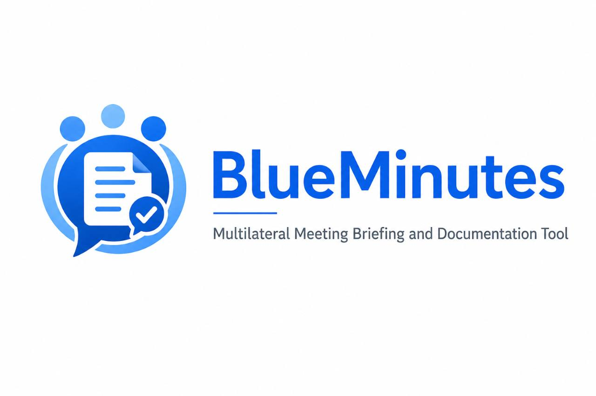

# BlueMinutes

<p align="center">
  
</p>

> `BlueMinutes` is the public product and repository name. `MeetingBuddy`
> remains the internal Swift package and module family, executable name, bundle
> identifier, persistence name, and format compatibility identifier.

BlueMinutes is an open-source native macOS workbench for turning
long multilingual meetings into reviewable transcripts, structured positions,
evidence-linked briefing sections, and reusable historical context. It is
designed for diplomats, policy researchers, civil-society organizations,
international-organization staff, and other professional meeting users who
need to review the path from a generated claim back to exact source evidence.

BlueMinutes is an independent personal open-source project. It is not
affiliated with, sponsored by, or endorsed by the United Nations, any United
Nations entity, any government, or OpenAI.

## Why this exists

My work involves multilateral diplomacy in the UN ecosystem. Rapidly organizing
hours of multilingual meeting material into accurate, reviewable briefs is a
recurring pressure point for delegations, international-organization staff,
researchers, and civil-society teams—especially when staffing is limited.

BlueMinutes is not intended to be another generic speech-to-text wrapper. Its
focus is the multilateral-meeting workflow: keeping original speech,
interpretation, machine translation, and human correction distinct; reviewing
delegation positions and qualifications; linking every consequential claim to
evidence; and assembling a briefing only through explicit review gates.

The project explores a privacy-conscious, auditable workflow rather than a
fully automatic decision maker. Derived claims retain exact evidence links,
uncertainty is preserved, and provider output remains quarantined until the
required application-owned or human review boundary is satisfied.

## Current capabilities

- Local media intake and canonical audio processing.
- On-device transcription and translation through provider interfaces.
- Structured diplomatic analysis with immutable provenance and evidence links.
- Evidence-linked briefing assembly with explicit section confirmation before
  export.
- Historical comparison that excludes unconfirmed positions and avoids
  inventing policy change.
- A local, read-only MCP surface with bounded tools and audited authority.
- Workspace backup, recovery, retention, and deletion controls.

The application is an internal alpha. It is not a substitute for professional
judgment, an official record, legal advice, or an authoritative statement of
any delegation's position.

## Privacy and trust model

- Meeting audio, transcripts, metadata, and derived intelligence remain local
  by default.
- Credentials belong in macOS Keychain and never in repository files.
- AI providers receive bounded application-owned requests and never query the
  database directly.
- Provider-only `noSpeech` and `nonSubstantive` classifications cannot silently
  close source coverage.
- Generated analysis and briefing text cannot enter consequential downstream
  workflows until the required explicit human confirmation is recorded.
- Open source enables independent review of privacy, provenance, storage, and
  model-routing decisions; it does not by itself guarantee security.

See [Security and privacy](docs/SECURITY_PRIVACY.md),
[Storage policy](docs/STORAGE_POLICY.md), and [Threat model](docs/THREAT_MODEL.md).

## Open-source readiness

The current pre-publication warning-as-error gate passes a 248-test suite in 43
suites. Three installed Apple-model routes remain explicit opt-in checks and
are not represented as ordinary-CI passes. The repository includes conservative
CI, Apache License 2.0, contribution and security policies, a threat model,
maintenance and recovery procedures, and synthetic-fixture requirements.

BlueMinutes is pre-release and does not claim broad adoption, production users,
institutional endorsement, or security certification. See the
[open-source readiness evidence map](docs/OPEN_SOURCE_READINESS.md) for the
claim-to-evidence path and the remaining public-submission gates.

## Requirements

- macOS 15 or later.
- Apple Silicon for the currently validated internal-alpha app bundle.
- Swift 6.1 language mode and a supported full Xcode installation.
- macOS 26 or later for the current Apple on-device Speech, Translation, and
  Foundation Models provider adapters. Other code and deterministic tests run
  without those installed models.

## Build and test

Clone the repository, then run:

```sh
swift package resolve
swift build -Xswiftc -warnings-as-errors
swift test -Xswiftc -warnings-as-errors
```

To build an ad-hoc local app bundle without publishing it:

```sh
script/build_and_run.sh --stage-only
```

That script creates ignored local output under `dist/`. It does not create a
GitHub Release, notarize an app, or authorize distribution.

The staged macOS application displays the BlueMinutes name and icon while
retaining compatibility-sensitive internal identifiers. Brand asset provenance
and use boundaries are documented in [Brand](docs/BRAND.md).

The three installed-model smoke tests are opt-in and use synthetic data only.
Ordinary CI does not require production services, repository secrets, real
meeting material, signing, notarization, deployment, or release credentials.

## Architecture

The codebase is a Swift modular monolith:

- `MeetingBuddyDomain` owns validated semantic contracts.
- `MeetingBuddyApplication` owns use-case and provider boundaries.
- `MeetingBuddyPersistence` owns SQLite and local storage adapters.
- `MeetingBuddyTasks` owns durable long-running work.
- `MeetingBuddyMedia` owns native media and recording adapters.
- `MeetingBuddyAI` owns bounded AI pipelines and application-owned validation.
- `MeetingBuddyFeatures` and `MeetingBuddyApp` own the macOS review experience.
- `MeetingBuddyAutomation`, `MeetingBuddyCLI`, and `MeetingBuddyMCP` expose
  separate bounded operator surfaces.

Start with [Current architecture](docs/CURRENT_ARCHITECTURE.md) and the
[ADR index](docs/adr/README.md).

## Contributing

Read [CONTRIBUTING.md](CONTRIBUTING.md) and [AGENTS.md](AGENTS.md) before making
changes. Every change is Issue-first, uses a short-lived branch, preserves
backward compatibility and user data, runs the required tests, and is reviewed
through a Pull Request. Never commit real meeting material, diplomatic records,
credentials, databases, workspaces, logs, models, or generated briefings.

Maintenance, backup, release, support, and community policies are documented in
[Maintenance](docs/MAINTENANCE.md),
[Backup and recovery](docs/BACKUP_AND_RECOVERY.md),
[Release checklist](docs/RELEASE_CHECKLIST.md), [Roadmap](ROADMAP.md),
[Support](SUPPORT.md), and the [Code of Conduct](CODE_OF_CONDUCT.md). Report vulnerabilities through
[SECURITY.md](SECURITY.md), not a public Issue.

## License

Project-authored source code, documentation, and bundled brand assets are
licensed under the [Apache License 2.0](LICENSE). The license does not grant
trademark rights beyond its Section 6; see [Brand](docs/BRAND.md). Third-party
notices are in [`ThirdPartyNotices/`](ThirdPartyNotices/).
