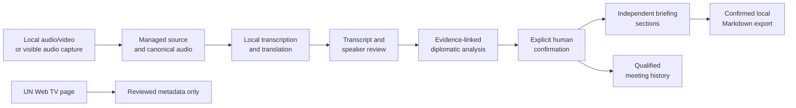

# BlueMinutes

<p align="center">
  
</p>

<p align="center">
  <a href="https://github.com/crescentln/BlueMinutes/actions/workflows/ci.yml"></a>
  <a href="LICENSE"></a>
  
  
</p>

BlueMinutes is a local-first native macOS workbench for turning long
multilingual meetings into reviewable transcripts, evidence-linked diplomatic
analysis, briefing sections, and qualified historical context.

It is designed for multilateral diplomacy and United Nations meeting workflows,
where a useful record must preserve not only the words that were recognized but
also the language path, speaker and represented entity, reservations and
conditions, exact source evidence, review state, and later corrections.

> **Project status:** source-only internal alpha. BlueMinutes can be built and
> run locally, but there is no signed, notarized, or supported downloadable
> release. It must not be treated as an official record or a substitute for
> professional review.

BlueMinutes is an independent open-source project. It is not affiliated with,
sponsored by, or endorsed by the United Nations, any United Nations entity, or
any government.

## Contents

- [What BlueMinutes does](#what-blueminutes-does)
- [Beyond conventional speech-to-text](#beyond-conventional-speech-to-text)
- [Current capabilities](#current-capabilities)
- [Quick start](#quick-start)
- [Using the app](#using-the-app)
- [CLI and local MCP](#cli-and-local-mcp)
- [Privacy and trust model](#privacy-and-trust-model)
- [Architecture](#architecture)
- [Known limitations](#known-limitations)
- [Documentation and contributing](#documentation-and-contributing)

## What BlueMinutes does

BlueMinutes implements a review-first meeting pipeline:



The workflow is intended for tasks such as:

- reviewing hours-long meetings without flattening original speech,
  simultaneous interpretation, machine translation, and human corrections;
- identifying who spoke and in what capacity, including countries,
  organizations, chairs, experts, observers, and group representatives;
- preserving support, opposition, requests, proposals, reservations,
  qualifications, and conditions as separate evidence-linked fields;
- assembling reviewable briefing sections from exact confirmed inputs instead
  of rewriting an entire transcript into one opaque summary; and
- comparing confirmed positions across meetings without treating wording
  changes, silence, or group membership as proof of policy change.

## Beyond conventional speech-to-text

Speech-to-text is one stage of BlueMinutes, not the final product. The table
below describes the difference in intended output rather than making a claim
about every transcription tool.

| Concern | Typical STT output | BlueMinutes workflow |
| --- | --- | --- |
| Primary result | Time-aligned text | A reviewed chain from source media to transcript, structured positions, briefing sections, and history |
| Multilingual provenance | One flattened transcript or translation | Original speech, interpretation, machine translation, and user edits remain distinct |
| Completeness | Best-effort recognition | Publication fails unless every eligible audio range or source segment has an explicit accounted-for outcome |
| Speaker context | Speaker label | Actor, represented entity, speaking capacity, confidence, evidence, and confirmation state |
| Meeting meaning | Generic summary | Typed issues, positions, commitments, decisions, reservations, conditions, and evidence references |
| Corrections | In-place text edit | Immutable revisions with exact downstream stale propagation |
| Review boundary | Optional transcript edit | Consequential analysis and briefing export require explicit confirmation of exact current revisions |
| Historical comparison | Text search or semantic similarity | Deterministic retrieval over confirmed positions with qualified, evidence-linked comparison states |
| Data routing | Provider-dependent | Local by default, with application-owned policy checks and no current outbound inference provider |

## Current capabilities

| Area | Available now | Processing and network boundary |
| --- | --- | --- |
| Local media intake | MOV, MP4, M4A, MP3, and WAV inspection; explicit audio-track and speech-provenance selection; verified managed copy | Local only; the original source is not modified |
| Canonical audio | 16 kHz mono signed-int16 CAF, deterministic chunking, checkpoints, retry, and exact range accounting | Local workspace and Task Manager |
| Visible audio capture | Microphone, one user-selected application, or both as separate tracks | Local only; requires visible user action and macOS permissions; no screen/video, hidden, all-system, or multi-app capture |
| UN Web TV metadata | Reviewed title, date, duration, body, language, and related metadata candidates from a supported asset page | One explicit credential-free HTTPS request to exact `webtv.un.org`; no player inspection, media acquisition, download, or redistribution |
| Transcription and translation | Apple on-device Speech and Translation on macOS 26+ when required language assets are installed; complete manual transcript/translation fallback | Local device; no cloud ASR or translation adapter |
| Diplomatic analysis | Evidence-linked participants, organizations, issues, positions, commitments, decisions, intervention cards, and delegation-position cards | Bounded Apple on-device Foundation Models route on macOS 26+; candidate output remains quarantined until exact human confirmation |
| Briefing | One multilateral template with Meeting Overview, Major Issues, and Major Delegations; per-section editing, locking, regeneration, validation, and Markdown export | Local generation and export; only confirmed current sections may be exported |
| Meeting history | Deterministic filters over confirmed published positions, qualified comparison, and visible presentation preferences | Local lexical and exact-identity retrieval; no hidden vector or LLM memory |
| Storage and recovery | Private workspace files, SQLite metadata, managed assets, job recovery, storage reporting, Workspace Trash, and verified cold-backup tooling | Local workspace; no cloud synchronization |
| Automation | Typed local CLI plus a local stdio MCP server with seven read-authority tools | No HTTP listener or remote control; MCP calls append bounded local audit metadata |

## Quick start

### Requirements

- macOS 15 or later is declared by the Swift package.
- Apple Silicon is the currently validated architecture.
- Swift 6 language mode and a full Xcode installation are required.
- macOS 26 and installed Apple language/model assets are required for automatic
  transcription, translation, analysis, and briefing generation. The verified
  development toolchain is Xcode 26.6.

### Clone, build, and test

```sh
git clone https://github.com/crescentln/BlueMinutes.git
cd BlueMinutes

swift package resolve
swift build -Xswiftc -warnings-as-errors
swift test -Xswiftc -warnings-as-errors
```

CI runs the warning-as-error build and the complete synthetic-safe test suite.
Installed Apple-model smoke tests are deliberately opt-in and use only
project-authored synthetic inputs.

### Stage and open the app

```sh
./script/build_and_run.sh --stage-only
open dist/MeetingBuddy.app
```

The script creates an ignored, ad-hoc-signed development bundle under `dist/`.
The application displays the BlueMinutes name and icon; the bundle path retains
the internal `MeetingBuddy` compatibility name. This is a local development
build, not a distributable release.

Running `./script/build_and_run.sh` without `--stage-only` also opens the app,
but first stops an existing `MeetingBuddyApp` process.

## Using the app

1. **Choose a workspace.** Select an existing BlueMinutes workspace or an empty
   local folder. The app stores its database, managed media, exports, backups,
   logs, tasks, and Trash inside that workspace.
2. **Add a source.** Import a supported local audio/video file or start a
   visible audio recording. A UN Web TV asset page may be used for reviewed
   metadata only; authorized media must be supplied separately.
3. **Set source context.** Enter the meeting title, classification, language,
   audio track, and whether the speech is original, interpreted, translated, or
   unknown.
4. **Create canonical audio.** BlueMinutes copies and hashes the source,
   normalizes audio, creates deterministic chunks, and records exact coverage.
5. **Review the transcript.** Use installed Apple models on macOS 26+, or enter
   and confirm a complete transcript/translation manually. Corrections create
   new revisions rather than overwriting source history.
6. **Confirm speakers and analysis.** Review identity, capacity, evidence,
   qualifications, and uncertainty before confirming the exact analysis
   ledger.
7. **Prepare the briefing.** Generate the three current sections, edit or lock
   them independently, review validation results, and confirm the current
   final before local Markdown export.
8. **Review history and storage.** Search confirmed positions, inspect qualified
   comparisons, manage visible presentation preferences, and review workspace
   storage and Trash.

## CLI and local MCP

Both automation surfaces require an existing absolute workspace path. They do
not accept arbitrary filesystem or database access. Opening an older supported
workspace may create a verified rollback backup and run its ordered schema
migrations.

### CLI

Inspect the exact command catalog:

```sh
swift run meetingbuddy-cli --help
```

Example read command:

```sh
swift run meetingbuddy-cli \
  --workspace /absolute/path/to/BlueMinutesWorkspace \
  status workspace
```

The CLI supports bounded catalog, workspace/policy/storage status, settings,
activity, rollback, and diagnostics operations. It cannot start recording,
invoke models, export meeting content, delete data, change credentials or
access policy, execute arbitrary SQL, or operate arbitrary paths. See
[Task 009A automation](docs/TASK_009A_AUTOMATION.md).

### Local MCP server

Build the executable and configure an MCP host to launch the printed binary
path with the exact arguments below:

```sh
swift build --product meetingbuddy-mcp
swift build --show-bin-path

/absolute/path/from-the-command/meetingbuddy-mcp \
  --workspace /absolute/path/to/BlueMinutesWorkspace \
  --approve-read-tools-with-local-audit
```

The local stdio server exposes exactly seven read-authority tools:

- `describe_settings`
- `get_command_catalog`
- `get_meeting_policy_status`
- `get_settings`
- `get_storage_report`
- `get_workspace_status`
- `list_activity`

There is no HTTP transport, socket, discovery service, provider/model tool,
recording command, export command, credential flow, or remote-control surface.
Tool calls do write bounded, content-free audit metadata to the local
workspace. See [Task 009B MCP](docs/TASK_009B_MCP.md).

## Privacy and trust model

- Meeting audio, transcripts, metadata, and derived intelligence remain in the
  selected local workspace by default.
- The current inference routes use installed Apple models on the local device.
  There is no outbound inference provider or automatic provider fallback.
- The only implemented network route is an explicit, bounded request for
  metadata from an exact `webtv.un.org` asset page; offline/no-outbound mode
  disables it.
- Credentials belong in macOS Keychain. They are not stored in repository
  files, workspaces, task directories, or logs.
- Imported text and web metadata are treated as untrusted data and cannot
  change application policy, provider routing, tool permissions, or protected
  diplomatic rules.
- Provider output is candidate material. Application-owned coverage and schema
  checks run before persistence, and explicit human confirmation gates
  consequential analysis and briefing export.
- Telemetry and third-party crash reporting are disabled. Logs are bounded and
  redact credentials and sensitive content.

Open source makes these controls reviewable; it does not guarantee that model
output or human review is correct. See [Security and privacy](docs/SECURITY_PRIVACY.md),
[Storage policy](docs/STORAGE_POLICY.md), and [Threat model](docs/THREAT_MODEL.md).

## Architecture

BlueMinutes is a Swift 6 modular monolith:

| Component | Responsibility |
| --- | --- |
| `MeetingBuddyDomain` | Immutable versioned contracts, provenance, evidence, validation, and stale-dependency rules |
| `MeetingBuddyApplication` | Use cases and provider, policy, storage, task, review, capture, export, history, and automation ports |
| `MeetingBuddyPersistence` | SQLite repositories, workspace storage, managed assets, migrations, recovery, and local export |
| `MeetingBuddyTasks` | The single durable task runtime for long-running and recoverable work |
| `MeetingBuddyMedia` | AVFoundation intake, canonical audio, visible capture, recording persistence, and UN Web TV metadata parsing |
| `MeetingBuddyAI` | Bounded Apple on-device providers, protected prompts, pipeline orchestration, and application-owned validation |
| `MeetingBuddyFeatures` / `MeetingBuddyApp` | Native SwiftUI review experience and composition root |
| `MeetingBuddyAutomation` / CLI / MCP | Typed, permissioned local automation adapters |

GRDB 7.11.1 is the only external package dependency and is confined to the
persistence implementation and tests. Start with
[Current architecture](docs/CURRENT_ARCHITECTURE.md),
[Domain contracts](docs/DOMAIN_CONTRACTS.md), and the
[ADR index](docs/adr/README.md).

## Known limitations

- BlueMinutes is an internal alpha built from source. There is no Developer ID
  signature, notarization, Gatekeeper distribution proof, universal/Intel
  build, installer, automatic updater, or supported release download.
- Automatic Apple transcription, translation, analysis, and briefing require
  macOS 26, supported hardware/locales, and installed system model assets.
  Manual transcript and translation intake remain available, but there is no
  equivalent manual path that creates initial analysis and briefing candidates
  from scratch.
- Briefing currently has one multilateral template and three sections.
- Historical search is conservative lexical and exact-identity retrieval, not
  semantic search, fuzzy entity resolution, a relationship graph, or automatic
  geopolitical inference.
- UN Web TV support is metadata-only. BlueMinutes does not download, extract,
  re-record, or redistribute UN footage.
- Native capture is visible and recoverable by design, but intended-identity
  TCC behavior, device changes, long physical recordings, sleep, force-quit,
  and sudden power-loss behavior are not fully release-proven.
- Deterministic validation proves structure, source accounting, evidence keys,
  and required review states. It is not independent fact-checking, and human
  confirmation can still be mistaken.
- There is no cloud provider, cloud synchronization, HTTP API, remote MCP, or
  remote-control path.

See the [Roadmap](ROADMAP.md) and
[MVP acceptance record](docs/MVP_ACCEPTANCE.md) for current scope and deferred
work.

## Documentation and contributing

- [Contributing guide](CONTRIBUTING.md)
- [Support](SUPPORT.md)
- [Security policy](SECURITY.md)
- [Backup and recovery](docs/BACKUP_AND_RECOVERY.md)
- [Maintenance](docs/MAINTENANCE.md)
- [Release checklist](docs/RELEASE_CHECKLIST.md)
- [Code of Conduct](CODE_OF_CONDUCT.md)

Changes are Issue-first and reviewed through short-lived branches and Pull
Requests. Never commit real meeting material, diplomatic records, credentials,
databases, workspaces, logs, models, or generated briefings.

Project-authored source, documentation, and bundled brand assets are licensed
under the [Apache License 2.0](LICENSE). Third-party notices are in
[`ThirdPartyNotices/`](ThirdPartyNotices/). The license does not grant
trademark rights beyond its Section 6; see [Brand](docs/BRAND.md).

`BlueMinutes` is the public project and product name. Compatibility-sensitive
Swift modules, executable names, bundle identifiers, database names, command
names, protocol identifiers, and data formats continue to use `MeetingBuddy`.
